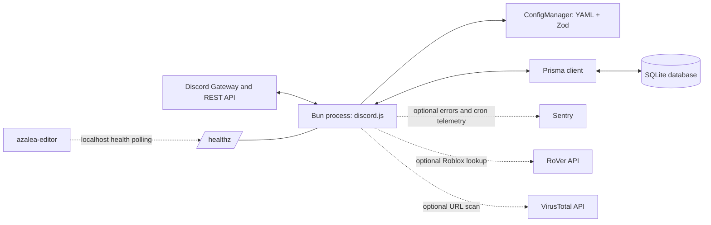

# Architecture overview

Azalea is a single-process Discord bot for moderation and server utilities. It receives gateway
events and interactions through discord.js, applies per-guild YAML configuration and role-based bot
permissions, acts through the Discord API, and stores state in SQLite through Prisma. Optional
integrations: Sentry (errors, traces, cron monitoring), RoVer (Roblox lookup), and VirusTotal (URL
scans).

## Components

| Component       | Responsibility                                                       | Location                                                           |
|-----------------|----------------------------------------------------------------------|--------------------------------------------------------------------|
| Discord runtime | Gateway connection, commands, event listeners, interactive components | `src/commands/`, `src/events/`, `src/components/`, `src/managers/` |
| Configuration   | Load and validate global and per-guild YAML, apply defaults           | `src/managers/config/`, `azalea.cfg.yml`, `configs/`               |
| Persistence     | SQLite schema, migrations, typed access through Prisma               | `prisma/`                                                          |
| Scheduled work  | Cron jobs (message cache, cleanup, review reminders, guild automations) and reminder timers | `src/events/Ready.ts`, `src/utils/`, `src/commands/Reminders.ts` |
| Observability   | Console logs, optional Sentry, loopback readiness endpoint           | `src/utils/`, `src/index.ts`                                       |

See [components](../components/README.md) for details.

## Boundaries and contracts

- Global config is `azalea.cfg.yml`; guild config is `configs/<guild_id>.yml`. Zod schemas in
  `src/managers/config/schema.ts` define the contract.
- Database structure is `prisma/schema.prisma`, evolved by committed migrations in `prisma/migrations/`.
- Commands, listeners, and component handlers are discovered from their directories.
- Two separate permission systems apply: Discord's native permissions (commands default to
  `ManageGuild`) and Azalea's role-to-permission mappings, checked by feature handlers.
- `/healthz` is a loopback readiness endpoint for the sibling `azalea-editor` service (not in this
  repository), not a public API.

## Constraints

- One Bun process with a local SQLite file; cron jobs and timers run in-process with no external
  queue. Run one instance per bot/database ([ADR 0001](decisions/0001-single-process-runtime.md)).
- Production runs under PM2 on a host or Docker Compose. CI builds a Docker image but does not
  publish it.
- Grant only the Discord permissions and intents that enabled features need.
