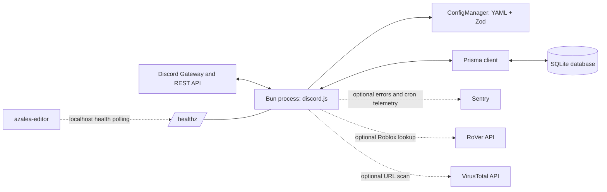

# Architecture overview

**Owner:** Azalea maintainers | **Last reviewed:** 2026-09-29 | **Status:** Current

## Purpose

Azalea is a single-process Discord bot for moderation and server utilities. It receives gateway
events and interactions through discord.js, applies guild-specific YAML configuration and role-based
bot permissions, uses Discord's API to perform actions, and stores moderation and feature state in a
SQLite database through Prisma. Optional integrations provide error/cron monitoring (Sentry), Roblox
account lookup (RoVer), and URL reputation checks (VirusTotal).

## System diagram

## Components

| Component       | Responsibility                                                                            | Owner              | Location                                                           |
|-----------------|-------------------------------------------------------------------------------------------|--------------------|--------------------------------------------------------------------|
| Discord runtime | Gateway connection, slash/context commands, event listeners, and interactive components   | Azalea maintainers | `src/commands/`, `src/events/`, `src/components/`, `src/managers/` |
| Configuration   | Parse and validate global and per-guild YAML, apply defaults, and provide runtime scoping | Azalea maintainers | `src/managers/config/`, `azalea.cfg.yml`, `configs/`               |
| Persistence     | SQLite schema, migrations, and typed access through Prisma                                | Azalea maintainers | `prisma/`, `src/`                                                  |
| Scheduled work  | Cron jobs for cleanup, reminders, and guild automations                                   | Azalea maintainers | `src/events/Ready.ts`, `src/utils/`                                |
| Observability   | Structured console logs, optional Sentry, and a local readiness endpoint                  | Azalea maintainers | `src/utils/`, `src/index.ts`                                       |

## Boundaries and contracts

- Discord is the external interaction and authorization surface. Discord IDs (snowflakes) identify
  users, guilds, channels, and roles.
- Global configuration is `azalea.cfg.yml`; guild configuration is `configs/<guild_id>.yml`. Zod
  schemas in `src/managers/config/schema.ts` define the runtime contract.
- Database structure is declared in `prisma/schema.prisma`; committed migrations in
  `prisma/migrations/` evolve the SQLite schema.
- Commands, event listeners, and component handlers are discovered from their respective TypeScript
  directories. Slash-command default Discord permissions are `ManageGuild` unless overridden;
  additional Azalea permissions are checked by feature handlers against guild role mappings. These
  are separate permission systems.
- `/healthz` is a local process-readiness endpoint, not a public API.

## Constraints and non-goals

- The app runs as one Bun process with a local SQLite database; no multi-node coordination or
  horizontal scaling contract is defined.
- Cron jobs run inside the bot process. There is no external queue, separate worker, or durable job
  broker.
- Production deployment paths are PM2 on a host and Docker Compose. CI builds a Docker image but
  does not publish it.
- Discord permissions, intents, and API limits constrain behavior. Configure only the permissions
  and intents required by enabled features.
- This repository does not contain the sibling `azalea-editor` application; it exposes only the
  loopback health endpoint used by that service.

Current implementation-derived decisions are recorded in [ADRs](decisions/README.md). They summarize
observable architecture; original decision history is not available in the repository.
